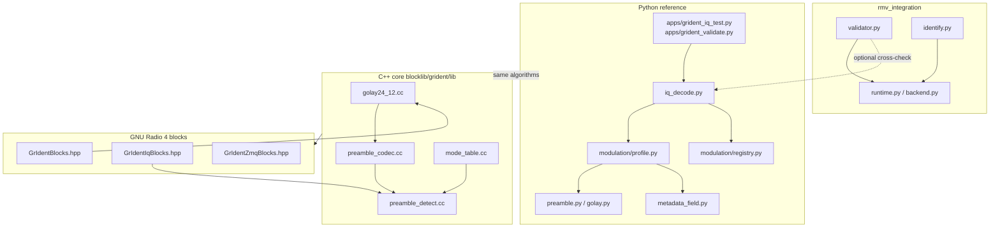
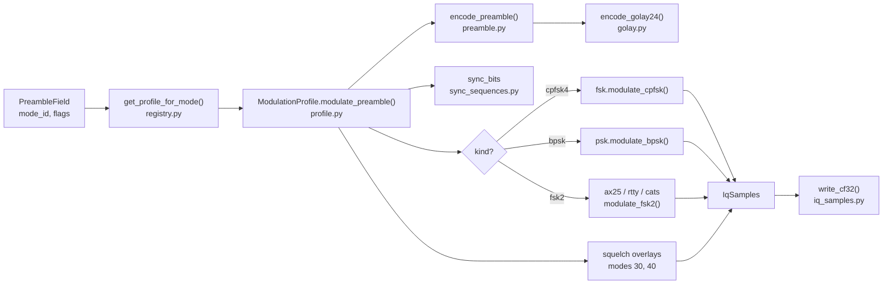
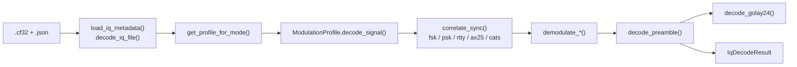
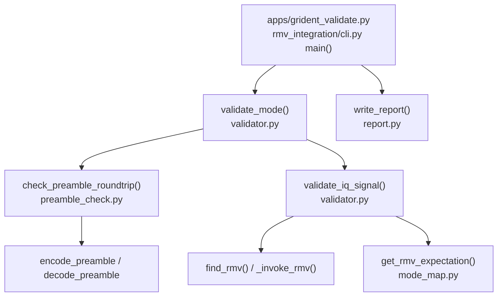
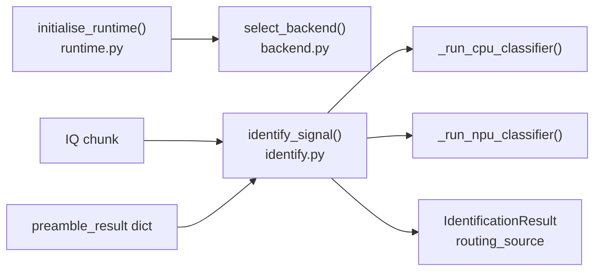

# gr-ident Code and Function Chart

Debug reference: function call flows, module map, tests, and entry points.
For GNU Radio block **ports** (TX/RX), see [port-diagrams.md](port-diagrams.md).

Set `PYTHONPATH=python` for all Python commands below.

---

## System overview



---

## IQ encode (generate captures)



| Entry point | Function | File |
|---|---|---|
| All common modes | `write_mode_capture()` | `generate_common_modes.py` |
| Single capture | `build_burst()` | `generate_test_iq.py` |
| Docs + fixtures | `regenerate_iq()` | `generate_docs.py` |
| Core air burst | `ModulationProfile.modulate_preamble()` | `modulation/profile.py` |
| Golay codeword | `encode_preamble()` | `preamble.py` |
| Profile lookup | `get_profile_for_mode()` | `modulation/registry.py` |

---

## IQ decode (receive path)



| Function | File | Role |
|---|---|---|
| `decode_iq_file()` | `iq_decode.py` | Load file, decode, return result |
| `decode_iq_signal()` | `iq_decode.py` | In-memory IQ |
| `load_iq_metadata()` | `iq_decode.py` | Sidecar JSON |
| `field_from_result()` | `iq_decode.py` | Build `PreambleField` |
| `main()` | `apps/grident_iq_test.py` | CLI |

C++ parallel: `detect_cpfsk4_preamble()` in `preamble_detect.cc`, used by GR4
`Cpfsk4PreambleDetect`.

---

## Validation (`grident_validate`)



| Function | File | Role |
|---|---|---|
| `main()` | `rmv_integration/cli.py` | CLI for `grident_validate.py` |
| `validate_mode()` | `validator.py` | Per-mode preamble + signal |
| `check_preamble_roundtrip()` | `preamble_check.py` | Golay fixture check |
| `validate_iq_signal()` | `validator.py` | rmv family/order compare |
| `get_rmv_expectation()` | `mode_map.py` | Mode ID to rmv labels |
| `generate_report()` | `report.py` | Markdown report body |

---

## Live identification (repeater runtime)



| Function | File | Role |
|---|---|---|
| `initialise_runtime()` | `runtime.py` | Detect NPU/CPU, set mode |
| `select_backend()` | `backend.py` | NPU preferred, CPU fallback |
| `identify_signal()` | `identify.py` | Preamble routes; classifier advisory |
| `apply_timeout_fallback()` | `runtime.py` | Degrade on classifier timeout |

---

## Preamble and metadata (Python)

| Function / class | File |
|---|---|
| `PreambleField`, `pack_field`, `unpack_field` | `preamble.py` |
| `encode_preamble`, `decode_preamble` | `preamble.py` |
| `codeword_to_bits_msb_first`, `bits_msb_first_to_codeword` | `preamble.py` |
| `encode_golay24`, `decode_golay24` | `golay.py` |
| `MetadataField`, `encode_metadata`, `decode_metadata` | `metadata_field.py` |
| `callsign_crc_nibble` | `metadata_field.py` |
| `SyncSequence`, `SYNC_*`, `ALL_SYNC_SEQUENCES` | `sync_sequences.py` |

---

## Modulation (Python)

| Module | Functions |
|---|---|
| `registry.py` | `get_profile`, `get_profile_for_mode`, `list_profiles`, `list_assigned_mode_ids`; profiles `NFM_125_*`, `CATS_9600`, … |
| `profile.py` | `ModulationProfile.modulate_preamble`, `modulate_bits`, `decode_signal`, `_correlate_sync`, `_demodulate_preamble` |
| `fsk.py` | `modulate_cpfsk`, `demodulate_cpfsk`, `correlate_sync`, `bits_to_symbols` |
| `psk.py` | `modulate_bpsk`, `demodulate_bpsk`, `correlate_sync` |
| `rtty.py` | `modulate_fsk2`, `demodulate_fsk2`, `correlate_sync` (50 baud) |
| `ax25.py` | `modulate_fsk2`, `demodulate_fsk2`, `correlate_sync` (1200 baud) |
| `cats.py` | `modulate_fsk2`, `demodulate_fsk2`, `correlate_sync` (9600 baud) |
| `squelch.py` | `ctcss_overlay`, `dcs_overlay` |

---

## TX control (Python + C++)

| Function | Python | C++ |
|---|---|---|
| Parse PTT / LinHT PMT | `parse_tx_control_message`, `parse_linht_pmt` | `parse_tx_control_message`, `parse_linht_pmt_message` |
| Format / send | `send_tx_control`, `format_linht_pmt` | — |
| Preamble JSON / topics | `format_preamble_result_json`, `preamble_result_topic` | `PreambleResultZmqPub` |
| Repeater ZMQ constants | `zmq_protocol.py` | `tx_control.h` |
| Files | `tx_control.py`, `zmq_protocol.py` | `tx_control.cc` |

GR4: `ZmqTxControlSub` calls C++ parser; drives `PreambleOnPtt`.

---

## C++ core (`blocklib/grident/lib/`)

| File | Functions / symbols |
|---|---|
| `golay24_12.cc` | `golay24_12::encode`, `golay24_12::decode` |
| `preamble_field.cc` | `pack_preamble_field`, `unpack_preamble_field` |
| `preamble_codec.cc` | `encode_preamble`, `decode_preamble`, bit/codeword helpers |
| `metadata_field.cc` | `pack_metadata_field`, `encode_metadata`, `decode_metadata_field` |
| `mode_table.cc` | `lookup_mode`, `mode_name`, `k_modes[]` |
| `sync_sequences_data.cc` | `sync_sequence_by_name` |
| `sync_correlator.cc` | `correlate_cpfsk4_sync`, `demodulate_cpfsk4_bits` |
| `modulation_profile.cc` | `cpfsk4_profile_by_name`, `cpfsk4_profile_for_mode_id` |
| `preamble_detect.cc` | `detect_cpfsk4_preamble` |
| `tx_control.cc` | `parse_tx_control_message`, `parse_linht_pmt_message` |

---

## GNU Radio 4 blocks (C++ templates)

| Header | Block structs (process / ports) |
|---|---|
| `GrIdentBlocks.hpp` | `GolayEncode`, `GolayDecode`, `PreambleSource`, `PreambleOnPtt`, `PreambleDecode`, `MetadataEncode`, `MetadataDecode` |
| `GrIdentIqBlocks.hpp` | `IqCf32FileSource`, `Cpfsk4SyncCorrelator`, `Cpfsk4PreambleDetect`, `PreambleDetectConsoleSink` |
| `GrIdentZmqBlocks.hpp` | `ZmqPushSink`, `ZmqPullSource`, `PreambleResultZmqPub`, `ZmqTxControlSub` |

---

## Applications and GR4 runners

| Path | `main` / role |
|---|---|
| `apps/grident_iq_test.py` | Decode one `.cf32` |
| `apps/grident_validate.py` | Two-layer IQ validation |
| `apps/gr4/grident_receive_flowgraph.cpp` | IQ file to `Cpfsk4PreambleDetect` |
| `apps/gr4/grident_run_flowgraph.cpp` | Run `.gr.yaml` graphs |
| `apps/gr4/grident_ptt_zmq_smoke.cpp` | PTT + `PreambleOnPtt` smoke test |
| `python/grident/generate_docs.py` | Regenerate docs, plots, `test-results.md` |

---

## Tests map

### Python (`python/tests/`)

| File | Covers |
|---|---|
| `test_grident.py` | Golay, preamble pack, Meson C++ hook, single IQ |
| `test_common_modes.py` | Eight common-mode fixtures, cross-ID matrix |
| `test_sync_metadata.py` | Sync sequences, metadata air, DMR/AX.25/CATS profiles |
| `test_tx_control.py` | LinHT PMT and gr-ident JSON PTT parse |
| `test_rmv_integration/` | Preamble check, validator, backend, identify, mode_map |

```bash
PYTHONPATH=python python3 -m unittest discover -s python/tests -v
```

### C++ (Meson)

| File | Role |
|---|---|
| `test_golay.cc` | Golay + mode table |
| `test_preamble_field.cc` | Field pack/unpack |
| `test_metadata_field.cc` | Metadata Golay |
| `test_tx_control.cc` | PTT message parse |
| `test_registry.cc` | GR4 block registry |

```bash
meson test -C build --verbose
ctest --test-dir build-gr4 --output-on-failure
```

---

## Mode ID to profile (assigned in Python)

| Mode ID | Name | Profile | Modulation module |
|---:|---|---|---|
| 20, 110 | NFM / EchoLink | `nfm_125_4800` | `fsk.py` |
| 30 | NFM + CTCSS | `nfm_125_ctcss_4800` | `fsk.py` + `squelch.py` |
| 40 | NFM + DCS | `nfm_125_dcs_4800` | `fsk.py` + `squelch.py` |
| 104 | C4FM | `c4fm_4800` | `fsk.py` |
| 108 | dPMR | `dpmr_4800` | `fsk.py` |
| 150, 151 | AX.25 / APRS | `ax25_1200` | `ax25.py` |
| 155 | CATS | `cats_9600` | `cats.py` |
| 158 | PSK31 | `psk31_3125` | `psk.py` |
| 159 | RTTY | `rtty_50` | `rtty.py` |

Source: `python/grident/modulation/registry.py` (`PROFILE_BY_MODE_ID`).

---

## Repository layout

```
gr-ident/
├── README.md
├── apps/                    CLI + GR4 flowgraph runners
├── blocklib/grident/        C++ core + GR4 block headers
├── build-gr4/               CMake GR4 plugin (local)
├── python/grident/          Reference library
├── python/tests/            Unit tests + IQ fixtures
├── test_iq/vectors/common/  Dev IQ vectors
└── docs/                    Generated docs, plots, this chart
```

---

## Common commands

```bash
# Regenerate docs, plots, test-results.md
PYTHONPATH=python python3 python/grident/generate_docs.py

# Test results only
PYTHONPATH=python python3 python/grident/generate_docs.py --test-results-only

# Generate common-mode IQ
PYTHONPATH=python python3 python/grident/generate_common_modes.py

# Decode one capture
PYTHONPATH=python python3 apps/grident_iq_test.py \
  --input python/tests/fixtures/common_modes/mode_020.cf32
```
