# Modulation Test Captures

Each mode uses a real air-interface profile. Waterfall plots are zoomed to the modulated body (with guard-silence context) at **14 kHz** wide (+/-7 kHz). Captures include **1 s guard silence** before and after the body.

All IQ files are **48 kHz** complex float32 (`.cf32`). Total duration is `num_samples / 48000`. Structure: **1 s lead silence + modulated body + 1 s trail silence**.

## Capture duration summary

| Mode ID | Name | Total | Lead silence | Body | Trail silence | Preamble only |
|---:|---|---:|---:|---:|---:|---:|
| 20 | NFM 12.5 kHz | 2.004 s | 1.000 s | 0.004 s | 1.000 s | 0.004 s |
| 30 | NFM 12.5 kHz + CTCSS | 2.104 s | 1.000 s | 0.104 s | 1.000 s | 0.004 s |
| 40 | NFM 12.5 kHz + DCS | 2.104 s | 1.000 s | 0.104 s | 1.000 s | 0.004 s |
| 104 | C4FM / Fusion | 2.005 s | 1.000 s | 0.005 s | 1.000 s | 0.005 s |
| 108 | dPMR | 2.005 s | 1.000 s | 0.005 s | 1.000 s | 0.005 s |
| 110 | EchoLink | 2.004 s | 1.000 s | 0.004 s | 1.000 s | 0.004 s |
| 158 | PSK31 | 3.280 s | 1.000 s | 1.280 s | 1.000 s | 1.280 s |
| 159 | RTTY | 2.800 s | 1.000 s | 0.800 s | 1.000 s | 0.800 s |

The **body** is the modulated segment (preamble burst, plus any squelch-tone tail for CTCSS/DCS profiles). **Preamble only** is the sync + Golay burst without the squelch tail.

## Mode 20 — NFM 12.5 kHz

- **Profile:** `nfm_125_4800`
- **Reference:** ETSI EN 300 113 (12.5 kHz channel); 4-FSK deviations per ETSI TS 102 490
- **Modulation:** cpfsk4, 4800 baud/sym/s
- **Digital flag:** False
- **Total duration:** 2.004 s (96200 samples)
- **Lead silence:** 1.000 s (48000 samples)
- **Modulated body:** 0.004 s (200 samples)
- **Trail silence:** 1.000 s (48000 samples)
- **Preamble burst only:** 0.004 s (200 samples)
- **Codeword:** 0xcb4014

### Waterfall (14 kHz wide, zoomed to modulation)

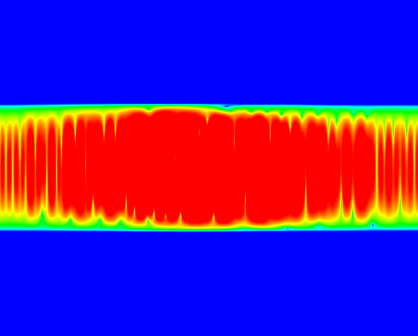

### Waterfall context (full capture)

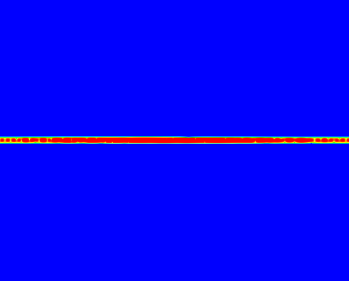

### Time domain (magnitude)

### Spectrum (14 kHz wide, averaged)

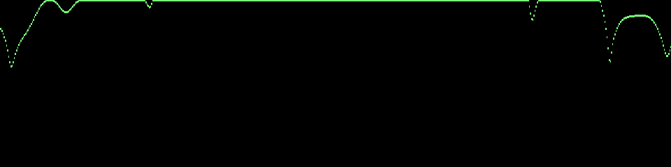

## Mode 30 — NFM 12.5 kHz + CTCSS

- **Profile:** `nfm_125_ctcss_4800`
- **Reference:** ETSI EN 300 113; EIA/TIA-603 CTCSS; 4-FSK per ETSI TS 102 490
- **Modulation:** cpfsk4, 4800 baud/sym/s
- **Digital flag:** False
- **Total duration:** 2.104 s (101000 samples)
- **Lead silence:** 1.000 s (48000 samples)
- **Modulated body:** 0.104 s (5000 samples)
- **Trail silence:** 1.000 s (48000 samples)
- **Preamble burst only:** 0.004 s (200 samples)
- **Codeword:** 0x5de01e

### Waterfall (14 kHz wide, zoomed to modulation)

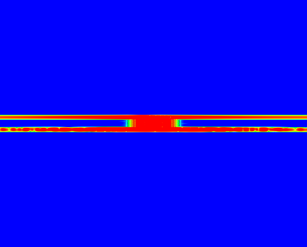

### Waterfall context (full capture)

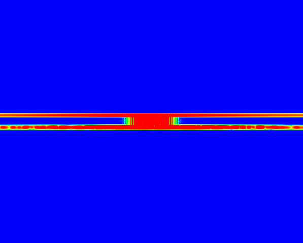

### Time domain (magnitude)

### Spectrum (14 kHz wide, averaged)

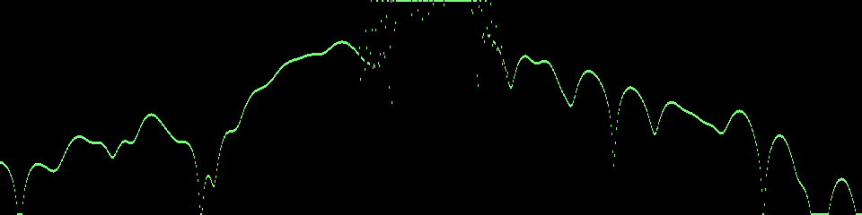

## Mode 40 — NFM 12.5 kHz + DCS

- **Profile:** `nfm_125_dcs_4800`
- **Reference:** ETSI EN 300 113; ETSI TS 103 236 DCS; 4-FSK per ETSI TS 102 490
- **Modulation:** cpfsk4, 4800 baud/sym/s
- **Digital flag:** False
- **Total duration:** 2.104 s (101000 samples)
- **Lead silence:** 1.000 s (48000 samples)
- **Modulated body:** 0.104 s (5000 samples)
- **Trail silence:** 1.000 s (48000 samples)
- **Preamble burst only:** 0.004 s (200 samples)
- **Codeword:** 0x65a028

### Waterfall (14 kHz wide, zoomed to modulation)

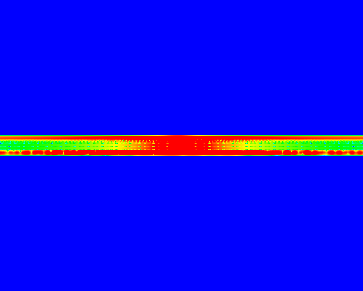

### Waterfall context (full capture)

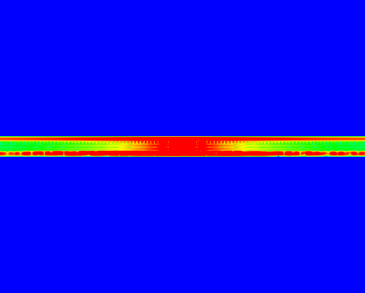

### Time domain (magnitude)

### Spectrum (14 kHz wide, averaged)

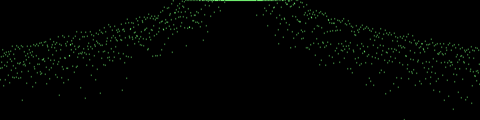

## Mode 104 — C4FM / Fusion

- **Profile:** `c4fm_4800`
- **Reference:** Yaesu System Fusion / C4FM amateur digital voice air interface
- **Modulation:** cpfsk4, 4800 baud/sym/s
- **Digital flag:** True
- **Total duration:** 2.005 s (96240 samples)
- **Lead silence:** 1.000 s (48000 samples)
- **Modulated body:** 0.005 s (240 samples)
- **Trail silence:** 1.000 s (48000 samples)
- **Preamble burst only:** 0.005 s (240 samples)
- **Codeword:** 0x314868

### Waterfall (14 kHz wide, zoomed to modulation)

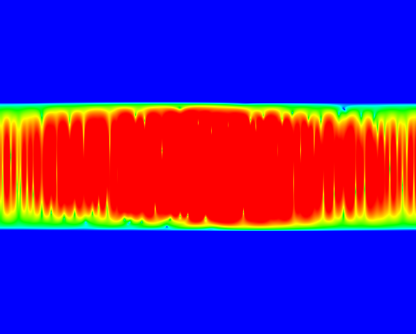

### Waterfall context (full capture)

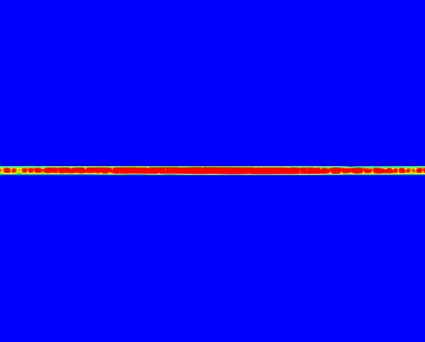

### Time domain (magnitude)

### Spectrum (14 kHz wide, averaged)

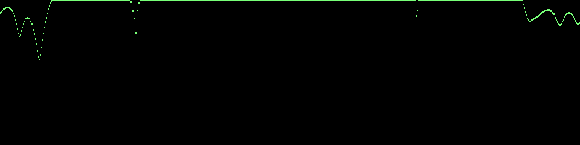

## Mode 108 — dPMR

- **Profile:** `dpmr_4800`
- **Reference:** ETSI TS 102 490-1 (dPMR air interface)
- **Modulation:** cpfsk4, 4800 baud/sym/s
- **Digital flag:** True
- **Total duration:** 2.005 s (96240 samples)
- **Lead silence:** 1.000 s (48000 samples)
- **Modulated body:** 0.005 s (240 samples)
- **Trail silence:** 1.000 s (48000 samples)
- **Preamble burst only:** 0.005 s (240 samples)
- **Codeword:** 0x92f86c

### Waterfall (14 kHz wide, zoomed to modulation)

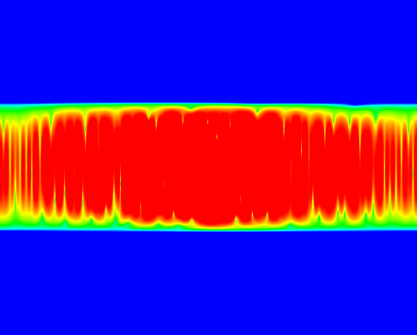

### Waterfall context (full capture)

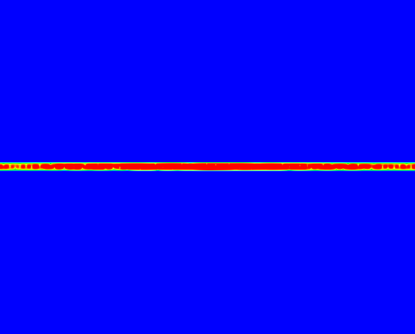

### Time domain (magnitude)

### Spectrum (14 kHz wide, averaged)

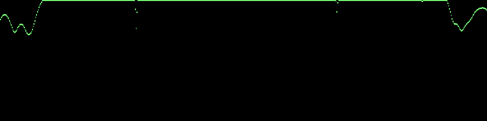

## Mode 110 — EchoLink

- **Profile:** `nfm_125_4800`
- **Reference:** ETSI EN 300 113 (12.5 kHz channel); 4-FSK deviations per ETSI TS 102 490
- **Modulation:** cpfsk4, 4800 baud/sym/s
- **Digital flag:** True
- **Total duration:** 2.004 s (96200 samples)
- **Lead silence:** 1.000 s (48000 samples)
- **Modulated body:** 0.004 s (200 samples)
- **Trail silence:** 1.000 s (48000 samples)
- **Preamble burst only:** 0.004 s (200 samples)
- **Codeword:** 0xd5886e

### Waterfall (14 kHz wide, zoomed to modulation)

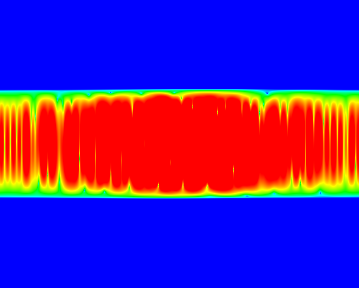

### Waterfall context (full capture)

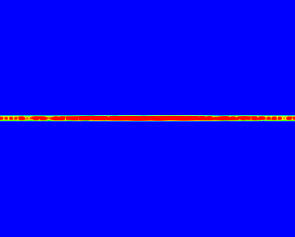

### Time domain (magnitude)

### Spectrum (14 kHz wide, averaged)

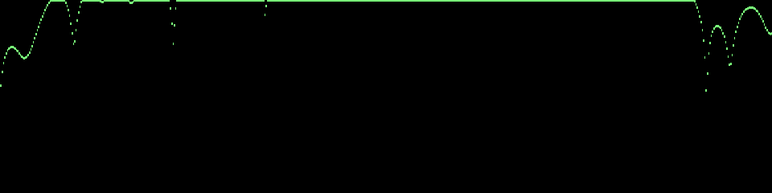

## Mode 158 — PSK31

- **Profile:** `psk31_3125`
- **Reference:** PSK31 amateur digital mode (BPSK, 31.25 baud Varicode payload)
- **Modulation:** bpsk, 31.25 baud/sym/s
- **Digital flag:** True
- **Total duration:** 3.280 s (157440 samples)
- **Lead silence:** 1.000 s (48000 samples)
- **Modulated body:** 1.280 s (61440 samples)
- **Trail silence:** 1.000 s (48000 samples)
- **Preamble burst only:** 1.280 s (61440 samples)
- **Codeword:** 0x3e289e

### Waterfall (14 kHz wide, zoomed to modulation)

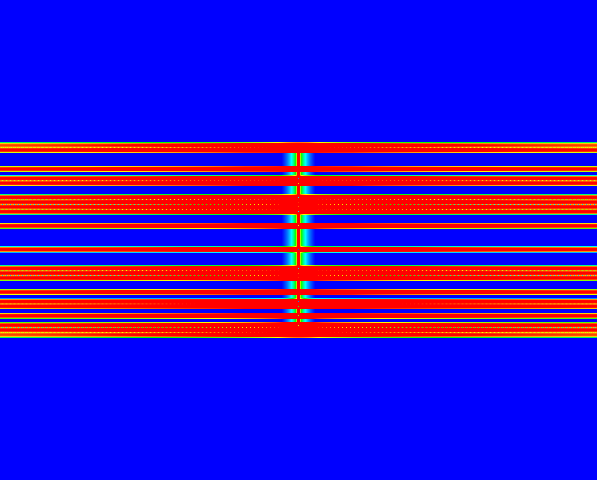

### Waterfall context (full capture)

### Time domain (magnitude)

### Spectrum (14 kHz wide, averaged)

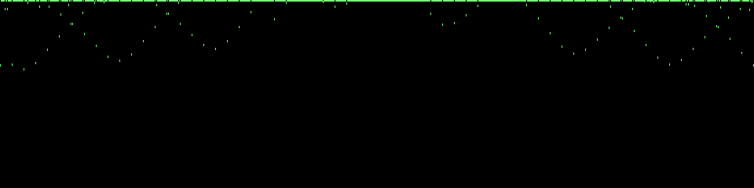

## Mode 159 — RTTY

- **Profile:** `rtty_50`
- **Reference:** ITA2 radioteletype (50 baud, 170 Hz frequency shift)
- **Modulation:** fsk2, 50 baud/sym/s
- **Digital flag:** True
- **Total duration:** 2.800 s (134400 samples)
- **Lead silence:** 1.000 s (48000 samples)
- **Modulated body:** 0.800 s (38400 samples)
- **Trail silence:** 1.000 s (48000 samples)
- **Preamble burst only:** 0.800 s (38400 samples)
- **Codeword:** 0xc1c89f

### Waterfall (14 kHz wide, zoomed to modulation)

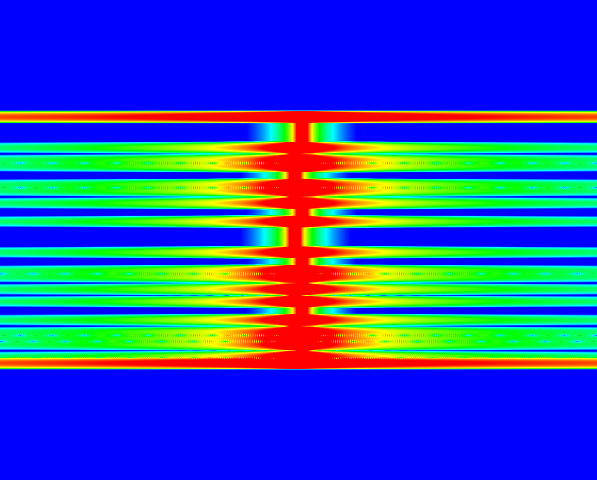

### Waterfall context (full capture)

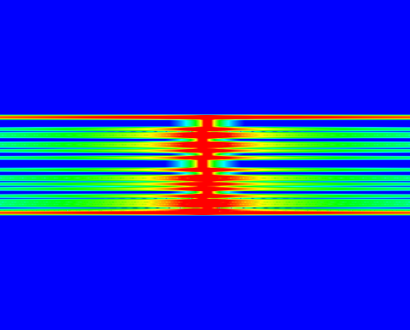

### Time domain (magnitude)

### Spectrum (14 kHz wide, averaged)

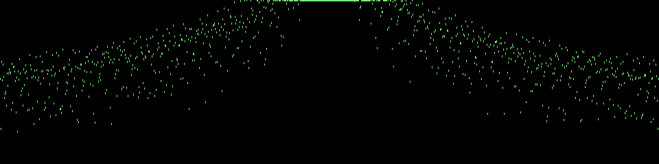

