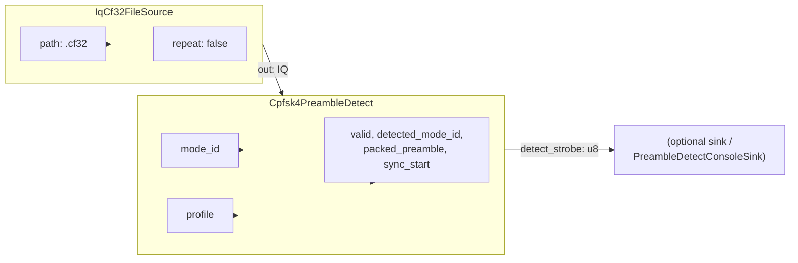
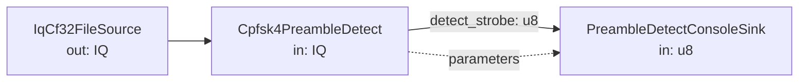
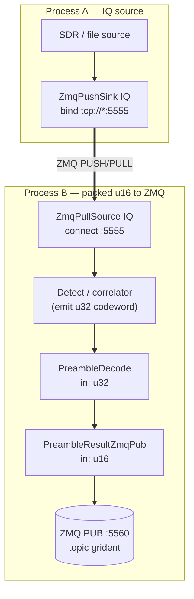
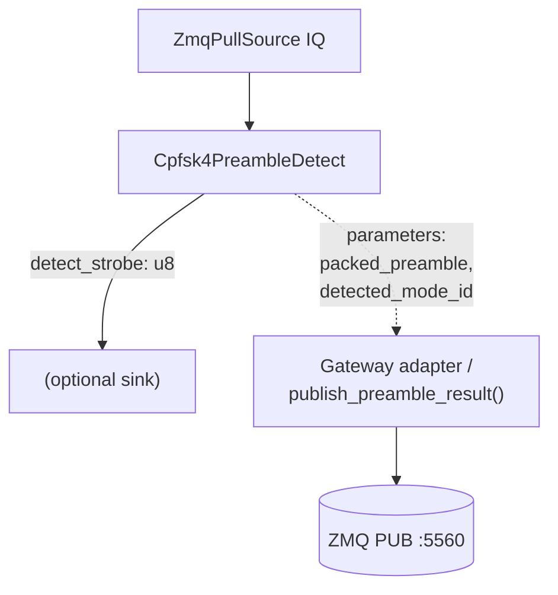
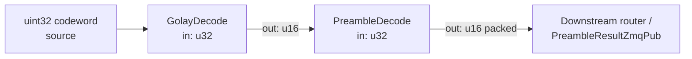
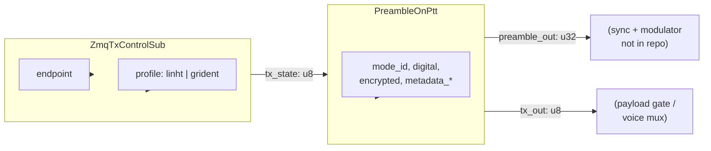
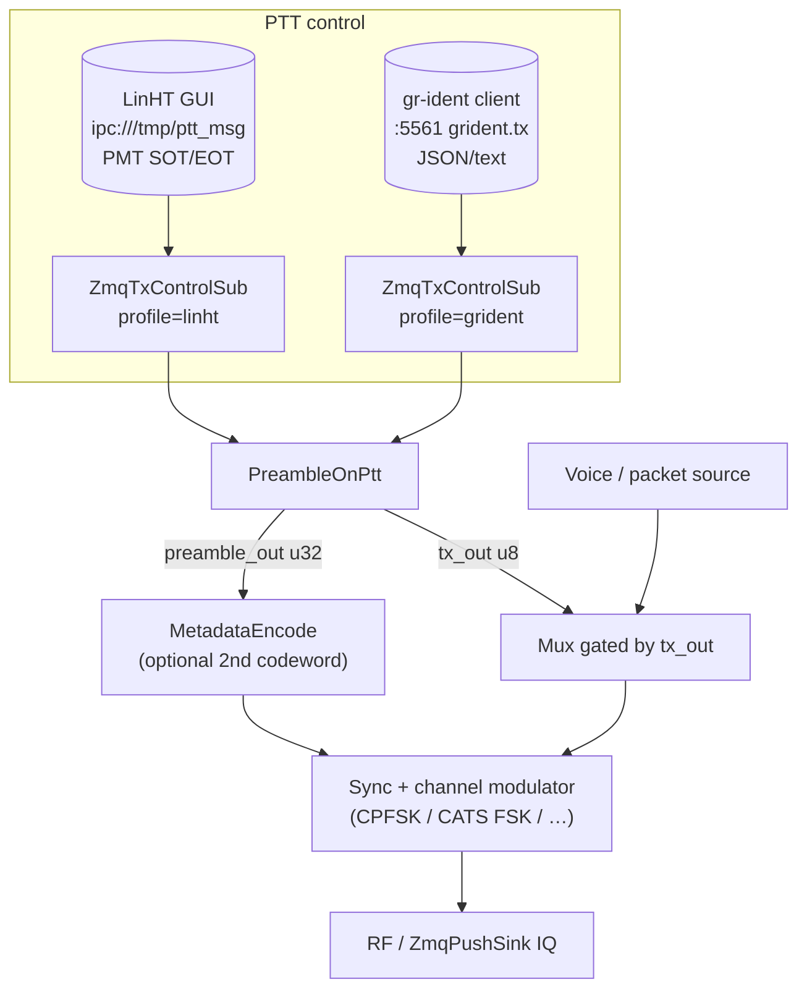
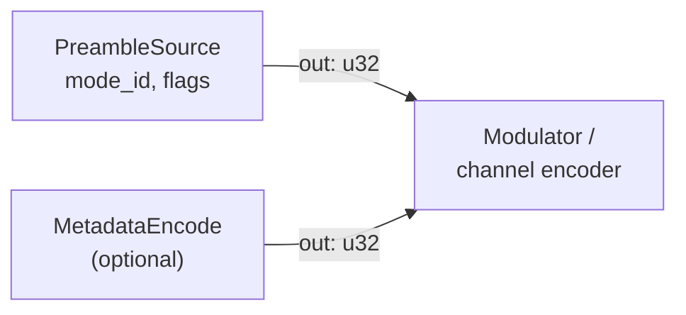
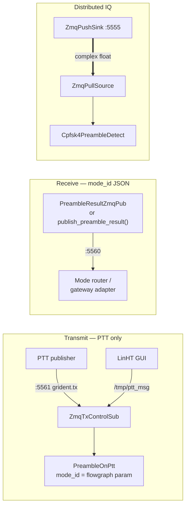
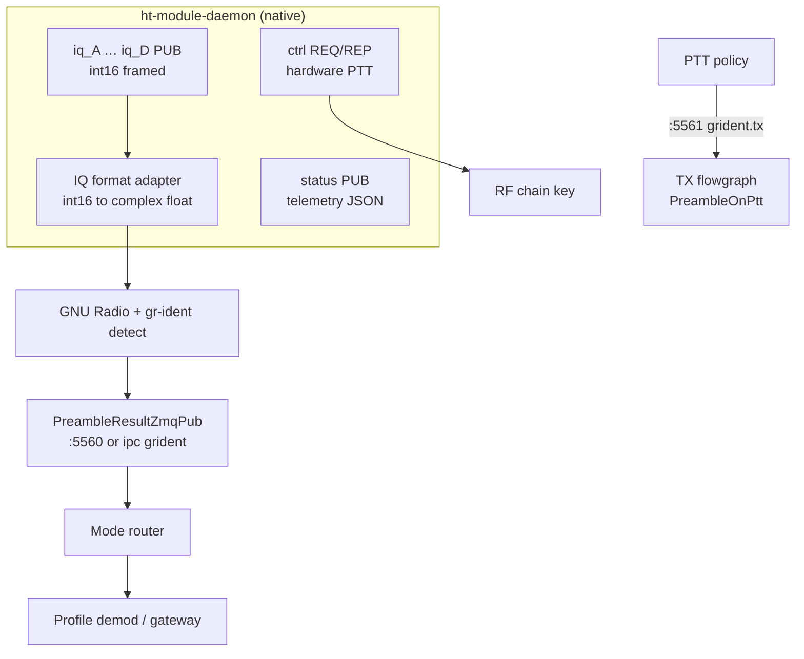

# gr-ident GNU Radio 4 Port Diagrams

Mermaid port diagrams for transmit (TX) and receive (RX) flowgraphs using gr-ident
blocks. These blocks are **GNU Radio 4.x** header-template blocks (`GR_REGISTER_BLOCK`);
there is no GNU Radio Companion 3.x `.grc` palette in this repository yet.

Reference YAML: [`apps/flowgraphs/`](../apps/flowgraphs/). Block inventory:
[`blocklib/grident/blocks/README.md`](../blocklib/grident/blocks/README.md).
ZeroMQ wire formats and [mode control via ZMQ](zeromq-protocol.md#mode-control-via-zeromq):
[`zeromq-protocol.md`](zeromq-protocol.md). Python helpers:
[`python/grident/zmq_protocol.py`](../python/grident/zmq_protocol.py).
SDR-repeater integration:
[zeromq-messages.md](https://github.com/Supermagnum/SDR-repeater/blob/main/zeromq-messages.md).

---

## Port type legend

| Type | Meaning |
|---|---|
| `IQ` | `std::complex<float>` stream |
| `u8` | `uint8_t` (PTT state, strobes) |
| `u16` | `uint16_t` (packed 12-bit preamble/metadata field) |
| `u32` | `uint32_t` (Golay 24-bit codeword) |
| ZMQ | External process socket (not a GR block port) |

Diagnostic **parameters** (`detected_mode_id`, `valid`, `sync_start`, …) are block
fields updated in-process; they are not stream ports unless wired explicitly in a
future flowgraph.

---

## Receive (RX)

### Minimal IQ file detect (in-repo YAML)

[`receive_iq_detect.gr.yaml`](../apps/flowgraphs/receive_iq_detect.gr.yaml) — CPFSK
profiles only (modes such as 20, 104, 110).

| Block | Port | Direction | Type |
|---|---|---|---|
| `IqCf32FileSource` | `out` | out | IQ |
| `Cpfsk4PreambleDetect` | `in` | in | IQ |
| `Cpfsk4PreambleDetect` | `detect_strobe` | out | u8 |

---

### RX with console diagnostics

`PreambleDetectConsoleSink` reads `detected_mode_id`, `packed_preamble`, `valid`, and
`sync_start` from the detect block configuration (same graph instance / bindings).

---

### Distributed RX (ZeroMQ IQ + JSON results)

Typical two-process layout from
[`zmq-distributed-demo.md`](../apps/flowgraphs/zmq-distributed-demo.md).

`Cpfsk4PreambleDetect` exposes `packed_preamble` and `detected_mode_id` as **block
parameters** (updated when `detect_strobe` pulses), not as stream ports.
`PreambleResultZmqPub` requires a **streamed** `u16` packed field on `in`. Use one of
the patterns below.

**Pattern A — codeword stream (GR blocks only):**

**Pattern B — IQ detect + application publish (in-repo detect block):**

| Block | Port | Direction | Type |
|---|---|---|---|
| `ZmqPullSource<std::complex<float>>` | `out` | out | IQ |
| `Cpfsk4PreambleDetect` | `in` | in | IQ |
| `Cpfsk4PreambleDetect` | `detect_strobe` | out | u8 |
| `PreambleDecode` | `in` | in | u32 |
| `PreambleDecode` | `out` | out | u16 |
| `PreambleResultZmqPub` | `in` | in | u16 |
| `PreambleResultZmqPub` | `out` | out | u16 (passthrough) |

**Subscriber:** `SUB` on `tcp://127.0.0.1:5560` (or `ipc:///run/ht-module/grident` on a
repeater), filter prefix `grident`. JSON body:
`mode_id`, `digital`, `encrypted`, `metadata_present`. Route demod from `mode_id` (see
[mode control via ZMQ](zeromq-protocol.md#mode-control-via-zeromq)).
Helpers: `subscribe_preamble_results()` in
[`zmq_protocol.py`](../python/grident/zmq_protocol.py).

---

### RX codec chain (bit-level, no IQ)

For lab bit-stream tests without over-the-air modulation:

| Block | Port | Direction | Type |
|---|---|---|---|
| `GolayDecode` | `in` / `out` | in / out | u32 / u16 |
| `PreambleDecode` | `in` / `out` | in / out | u32 / u16 |

---

## Transmit (TX)

### Minimal PTT preamble (in-repo YAML)

[`ptt_preamble.gr.yaml`](../apps/flowgraphs/ptt_preamble.gr.yaml) — preamble burst on
key-down only (null sinks in the reference graph).

| Block | Port | Direction | Type |
|---|---|---|---|
| `ZmqTxControlSub` | `tx_state` | out | u8 |
| `PreambleOnPtt` | `tx_in` | in | u8 |
| `PreambleOnPtt` | `preamble_out` | out | u32 |
| `PreambleOnPtt` | `tx_out` | out | u8 |

On each `tx_in` **0-to-1** edge: one primary Golay codeword; if `metadata_present`,
one metadata codeword on the next sample.

**Mode on transmit:** set `mode_id` (and flags) on `PreambleOnPtt` in the flowgraph.
ZeroMQ carries **PTT only** (`grident.tx` on `:5561` or LinHT `SOT`/`EOT`) — not a
remote “set mode” command.

---

### Full TX air chain (logical)

External modulator blocks are operator-specific; gr-ident supplies the preamble
codeword(s) and PTT gate signal.

---

### TX without ZMQ (static preamble source)

| Block | Port | Direction | Type |
|---|---|---|---|
| `PreambleSource` | `out` | out | u32 |
| `MetadataEncode` | `out` | out | u32 |

`PreambleSource` encodes `mode_id`, `encrypted`, `digital`, and `metadata_present`
into one Golay codeword per sample (see `n_samples`).

---

### TX Golay encode path (bit-level)

---

## ZeroMQ endpoints (TX and RX)

| Endpoint | Pattern | Role |
|---|---|---|
| `tcp://127.0.0.1:5555` | PUSH/PULL | Distributed IQ (`std::complex<float>`) |
| `tcp://127.0.0.1:5560` | PUB/SUB | **RX mode control** — JSON `mode_id` (+ flags) |
| `ipc:///run/ht-module/grident` | PUB/SUB | Same JSON on SDR-repeater (optional IPC) |
| `tcp://127.0.0.1:5561` | PUB/SUB | **TX PTT** — topic `grident.tx` (`profile=grident`) |
| `ipc:///tmp/ptt_msg` | PUB/SUB | LinHT PMT SOT/EOT (`profile=linht`) |

**Preamble topics (frame 0):** `grident`, `grident.A` … `grident.D`, or `grident.<band>`
(e.g. `grident.70cm`). Subscribers use ZMQ prefix filter `grident` to receive all.

Constants: C++ `tx_control.h`; Python `zmq_protocol.py`.

---

### SDR-repeater on-site (logical)

Repeater **native** IQ (`ipc:///run/ht-module/iq_*`, int16 framed, 500 kSa/s) is not
wire-compatible with gr-ident PUSH/PULL without a format adapter. gr-ident **control**
sockets match [SDR-repeater Section 6](https://github.com/Supermagnum/SDR-repeater/blob/main/zeromq-messages.md).

Hardware PTT on `ctrl` and gr-ident `grident.tx` are complementary: `ctrl` keys the PA;
`:5561` gates preamble insertion inside GNU Radio only.

---

## Block port quick reference

### `GrIdentBlocks` — codec

| Block | In | Out |
|---|---|---|
| `GolayEncode` | u16 | u32 |
| `GolayDecode` | u32 | u16 |
| `PreambleSource` | — | u32 |
| `PreambleOnPtt` | u8 `tx_in` | u32 `preamble_out`, u8 `tx_out` |
| `PreambleDecode` | u32 | u16 |
| `MetadataEncode` | — | u32 |
| `MetadataDecode` | u32 | u16 |

### `GrIdentBlocks` — IQ (CPFSK 4800 sym/s family)

| Block | In | Out |
|---|---|---|
| `IqCf32FileSource` | — | IQ |
| `Cpfsk4SyncCorrelator` | IQ | u8 `sync_found` |
| `Cpfsk4PreambleDetect` | IQ | u8 `detect_strobe` |
| `PreambleDetectConsoleSink` | u8 | — |

### `GrIdentZmqBlocks` (requires libzmq)

| Block | In | Out |
|---|---|---|
| `ZmqPushSink<T>` | stream `T` | — |
| `ZmqPullSource<T>` | — | stream `T` |
| `ZmqTxControlSub` | — | u8 `tx_state` |
| `PreambleResultZmqPub` | u16 | u16 |

---

## Profile coverage note

| Air interface | Example mode ID | In-repo GR4 IQ block |
|---|---|---|
| CPFSK 4-FSK 4800 sym/s | 20, 104, 110 | `Cpfsk4PreambleDetect` |
| PSK31 / RTTY / CATS 9600 | 158, 159, 155 | Python `iq_decode.py` only (no GR4 IQ block yet) |

See [`TESTING.md`](../TESTING.md) for runnable smoke tests,
[`apps/flowgraphs/zmq-distributed-demo.md`](../apps/flowgraphs/zmq-distributed-demo.md)
for ZMQ wiring, and
[`blocklib/grident/blocks/README.md`](../blocklib/grident/blocks/README.md) for build
instructions.
